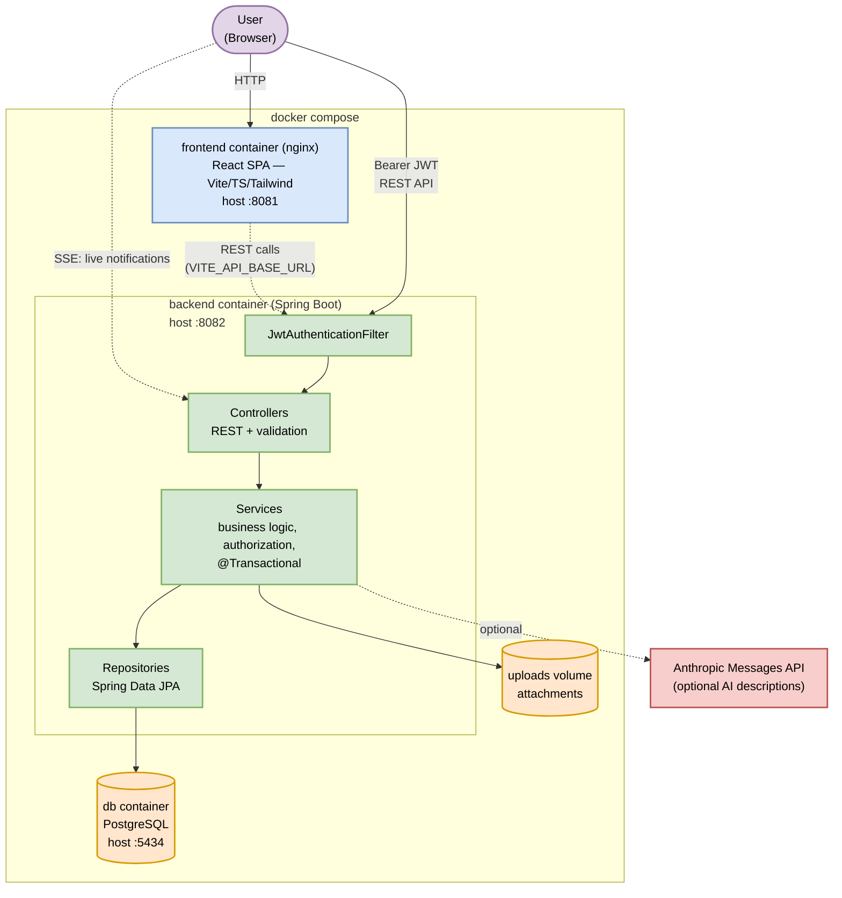
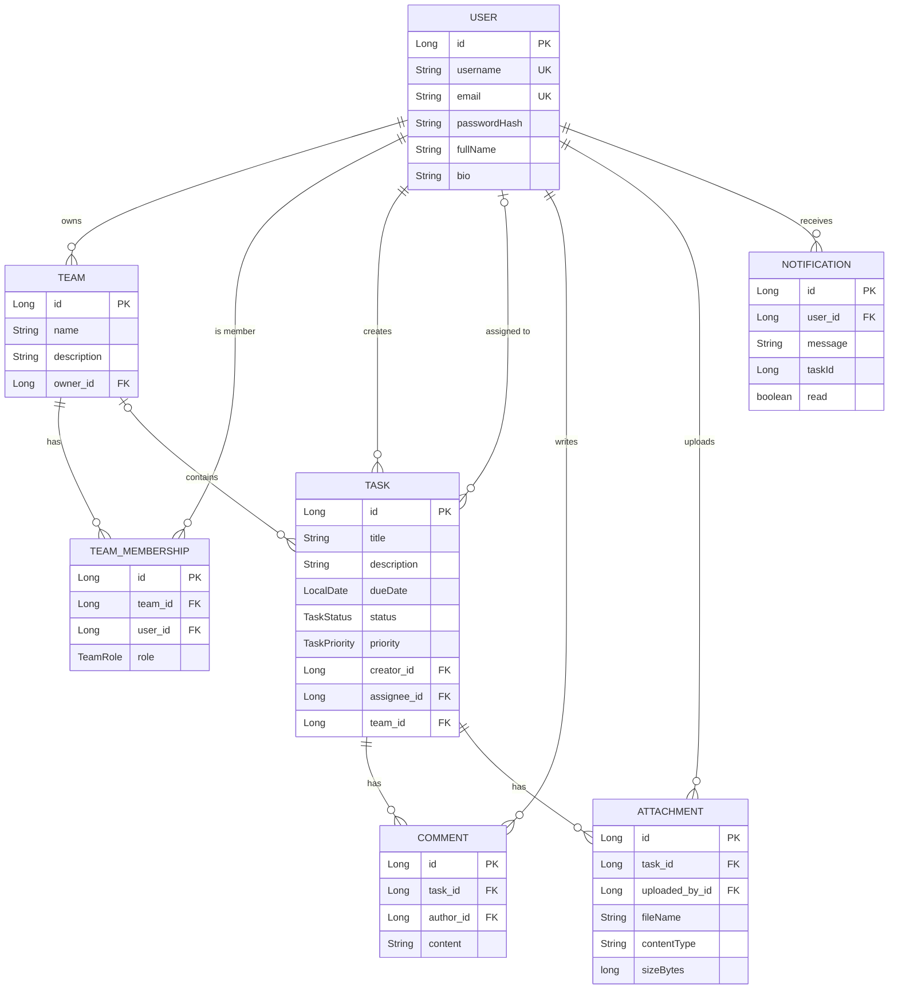

# TaskMaster — A Collaborative Task Tracking System

A backend system for task tracking and team collaboration, built with **Java 21 + Spring Boot 3**. Users can register, create and assign tasks, organize work into teams/projects, collaborate through comments and file attachments, receive real‑time notifications, and optionally auto‑generate task descriptions with a generative‑AI model.

This project was built for the AirTribe Backend AI Engineering course and demonstrates REST API design, layered architecture, JWT security, JPA persistence, dynamic querying, and an LLM integration.

---

## Table of contents

- [Tech stack](#tech-stack)
- [Features](#features)
- [Quick start (Windows)](#quick-start-windows)
- [Configuration](#configuration)
- [API reference](#api-reference)
- [Architecture](#architecture)
- [Data model (ER diagram)](#data-model-er-diagram)
- [Project structure](#project-structure)
- [Testing](#testing)
- [Design decisions](#design-decisions)
- [User stories coverage](#user-stories-coverage)

---

## Tech stack

| Concern | Choice |
|---|---|
| Language / runtime | Java 21 |
| Framework | Spring Boot 3.3 (Spring MVC) |
| Security | Spring Security 6 + JWT (jjwt) |
| Persistence | Spring Data JPA / Hibernate |
| Database | PostgreSQL (default), H2 in‑memory (tests only) |
| Password hashing | BCrypt |
| API docs | springdoc‑openapi (Swagger UI) |
| Build | Maven |
| Real‑time | Server‑Sent Events (SSE) |
| AI (optional) | Anthropic Messages API via JDK HttpClient |

---

## Features

- **Authentication & users** — register, login (by username *or* email), JWT‑based stateless sessions, explicit logout via server‑side token revocation, view/update profile. Passwords are stored only as BCrypt hashes.
- **Tasks** — full CRUD, plus filtering (status, priority, assignee, team, due date), free‑text search (title/description), sorting and pagination, status changes, and assignment.
- **Teams / projects** — create teams, list your teams, view members, and (as owner) add members. Tasks can be scoped to a team and assigned to team members.
- **Collaboration** — threaded comments and file attachments on tasks.
- **Real‑time notifications** — persisted notifications plus a live SSE stream; you're notified when a task is assigned to you, completed, or commented on.
- **AI assist (optional)** — generate a task description from a short title + keywords.
- **Cross‑cutting** — bean validation on all inputs, a global exception handler returning a consistent JSON error envelope, and interactive Swagger UI.

---

## Quick start (Windows)

### Prerequisites
- **JDK 21** — verify with `java -version`
- **Maven 3.9+** — verify with `mvn -version`
  (Install via `winget install Apache.Maven.Maven`, or just open the project in IntelliJ IDEA / VS Code with the Java + Maven extensions, which bundle Maven.)
- **PostgreSQL** — either run `docker compose up -d` (starts Postgres 16 with the default db/user/password below), or point the app at a native PostgreSQL install via the `DB_*` env vars.

### Run it
```powershell
# 1) Start PostgreSQL (db "taskmaster", user/password "taskmaster")
docker compose up -d

# 2) From the project root (where pom.xml is)
mvn spring-boot:run
```
The app starts on **http://localhost:8080** and connects to PostgreSQL at `jdbc:postgresql://localhost:5432/taskmaster` by default. Tables are created/updated automatically on startup (`ddl-auto: update`).

### Explore it
- **Swagger UI (try every endpoint in the browser):** http://localhost:8080/swagger-ui.html
- **REST Client examples:** open `api-examples.http` in VS Code (REST Client extension) and run requests top‑to‑bottom.

### Try the core flow with curl
```powershell
# 1) Register (returns a JWT)
curl -X POST http://localhost:8080/api/auth/register `
  -H "Content-Type: application/json" `
  -d "{\"username\":\"alice\",\"email\":\"alice@example.com\",\"password\":\"password123\",\"fullName\":\"Alice\"}"

# 2) Copy the "token" from the response, then create a task
curl -X POST http://localhost:8080/api/tasks `
  -H "Authorization: Bearer <PASTE_TOKEN>" `
  -H "Content-Type: application/json" `
  -d "{\"title\":\"My first task\",\"priority\":\"HIGH\"}"

# 3) List your tasks
curl http://localhost:8080/api/tasks -H "Authorization: Bearer <PASTE_TOKEN>"
```

### Build a runnable jar
```powershell
mvn clean package
java -jar target/taskmaster-1.0.0.jar
```

---

## Run with Docker

The whole stack — PostgreSQL, the Spring Boot backend, and the React frontend — can be brought up with a single command:

```powershell
docker compose up --build
```

This starts three services:

| Service | URL | Notes |
|---|---|---|
| `frontend` | http://localhost:8081 | React app (served by nginx) |
| `backend` | http://localhost:8082 | API + Swagger UI at `/swagger-ui.html` |
| `db` | `localhost:5434` | PostgreSQL 16, named volume `taskmaster-postgres-data` |

Open http://localhost:8081, register an account, and use the app — it talks to the backend container at `http://localhost:8082` (configured via the `VITE_API_BASE_URL` build arg, baked in at frontend build time). Host ports 8082/5434 (rather than the defaults 8080/5432) are used to avoid clashing with other services that may already be running on this machine; only the host-side ports differ — containers still talk to each other on their standard ports.

**Production note:** the default `APP_JWT_SECRET` in `docker-compose.yml` is a development placeholder. For any real deployment, set a strong, random secret via the `APP_JWT_SECRET` environment variable (e.g. in a `.env` file next to `docker-compose.yml`, which Compose loads automatically) — **do not use the default value**.

**Attachment storage caveat:** uploaded files are stored on the `taskmaster-uploads` volume, which works fine for this single-host setup but is local disk under the hood. If you deploy the backend across multiple instances or on an ephemeral/cloud filesystem, attachments won't be shared or durable — migrating to object storage (e.g. S3) is a known follow-up for production use.

---

## Configuration

All settings live in `src/main/resources/application.yml` and can be overridden with environment variables (see `.env.example`).

| Variable | Default | Purpose |
|---|---|---|
| `DB_URL` | `jdbc:postgresql://localhost:5432/taskmaster` | PostgreSQL JDBC URL |
| `DB_USERNAME` | `taskmaster` | PostgreSQL username |
| `DB_PASSWORD` | `taskmaster` | PostgreSQL password |
| `APP_JWT_SECRET` | a dev placeholder | JWT signing key (**≥ 32 chars**; change in production) |
| `APP_UPLOAD_DIR` | `uploads` | Directory for stored attachments |
| `APP_AI_ENABLED` | `false` | Enable the AI description endpoint |
| `ANTHROPIC_API_KEY` | *(empty)* | API key used when AI is enabled |
| `APP_AI_MODEL` | `claude-sonnet-4-6` | Model used for generation |
| `APP_CORS_ALLOWED_ORIGINS` | `http://localhost:5173` | Comma-separated origins allowed to call the API (CORS), for a separately deployed frontend |

### Starting PostgreSQL

The simplest option is Docker Compose, which starts Postgres 16 with the default db/user/password (`taskmaster`/`taskmaster`/`taskmaster`) and a persistent named volume:
```powershell
docker compose up -d
```

A native PostgreSQL install works too — just create a `taskmaster` database and a `taskmaster` user with access to it, or point `DB_URL`/`DB_USERNAME`/`DB_PASSWORD` at your existing server.

### Enabling the AI feature
```powershell
$env:APP_AI_ENABLED="true"
$env:ANTHROPIC_API_KEY="sk-ant-..."
mvn spring-boot:run
```
When disabled, `POST /api/ai/generate-description` returns a clear `400` explaining how to enable it, so the rest of the app runs fine without a key.

---

## API reference

All endpoints are prefixed with `/api`. Protected endpoints require an `Authorization: Bearer <token>` header. Full, interactive docs are at `/swagger-ui.html`.

### Authentication
| Method | Path | Description |
|---|---|---|
| POST | `/api/auth/register` | Create an account, returns a JWT |
| POST | `/api/auth/login` | Log in (username or email), returns a JWT |
| POST | `/api/auth/logout` | Revoke the current token |

### Users
| Method | Path | Description |
|---|---|---|
| GET | `/api/users/me` | Get your profile |
| PUT | `/api/users/me` | Update your profile |
| GET | `/api/users/search?q={query}` | Search users by username/email/full name (max 10 results); for team invites and assignee pickers |

### Tasks
| Method | Path | Description |
|---|---|---|
| POST | `/api/tasks` | Create a task |
| GET | `/api/tasks` | List tasks (filters: `status`, `priority`, `assigneeId`, `teamId`, `search`, `dueBefore`; paging: `page`, `size`, `sort`) |
| GET | `/api/tasks/{id}` | Get one task |
| PUT | `/api/tasks/{id}` | Update a task |
| PATCH | `/api/tasks/{id}/status` | Change status (e.g. complete) |
| PATCH | `/api/tasks/{id}/assign` | Assign to a user |
| DELETE | `/api/tasks/{id}` | Delete a task |

### Collaboration
| Method | Path | Description |
|---|---|---|
| POST | `/api/tasks/{taskId}/comments` | Add a comment |
| GET | `/api/tasks/{taskId}/comments` | List comments |
| POST | `/api/tasks/{taskId}/attachments` | Upload a file (multipart `file`) |
| GET | `/api/tasks/{taskId}/attachments` | List attachments |
| GET | `/api/attachments/{id}/download` | Download a file |

### Teams
| Method | Path | Description |
|---|---|---|
| POST | `/api/teams` | Create a team (you become owner) |
| GET | `/api/teams` | List your teams |
| GET | `/api/teams/{id}` | Get a team |
| GET | `/api/teams/{id}/members` | List members |
| POST | `/api/teams/{id}/members` | Add a member (owner only) |

### Notifications & AI
| Method | Path | Description |
|---|---|---|
| GET | `/api/notifications` | List your notifications |
| GET | `/api/notifications/unread-count` | Count unread |
| PATCH | `/api/notifications/{id}/read` | Mark read |
| GET | `/api/notifications/stream` | Live SSE stream |
| POST | `/api/ai/generate-description` | Generate a task description (optional) |

### Error format
Every error returns a consistent envelope:
```json
{
  "timestamp": "2026-06-13T10:00:00Z",
  "status": 404,
  "error": "Not Found",
  "message": "Task not found with id: 99",
  "path": "/api/tasks/99",
  "fieldErrors": null
}
```
Validation failures populate `fieldErrors` with field → message.

---

## Architecture

### High‑level design (HLD)



### Layered design (LLD)

The code follows a classic **Controller → Service → Repository** layering with DTOs at the boundary:

- **Controllers** handle HTTP concerns only: routing, request binding, validation (`@Valid`), and mapping results to responses. They extract the caller's id from the authenticated `UserPrincipal` and never touch the database directly.
- **Services** own all business logic and authorization rules, and define transaction boundaries (`@Transactional`). Cross‑service reuse (e.g. `TaskService` reusing `TeamService.requireMember`) keeps rules in one place.
- **Repositories** are Spring Data JPA interfaces. `TaskRepository` additionally extends `JpaSpecificationExecutor` so filters compose dynamically (see `TaskSpecifications`).
- **DTOs** (Java records) separate the API contract from entities — entities are never serialized directly, so the password hash and lazy relations never leak.
- **Security** is a stateless JWT filter that authenticates each request and populates the `SecurityContext`; an in‑memory blacklist supports logout.
- **Exceptions** are translated centrally by `GlobalExceptionHandler` into the standard error envelope.

**Authorization model**
- A task is *visible* to its creator, its assignee, and members of its team.
- Only the creator or assignee may *edit/delete* a task.
- Only a team owner may add members; tasks scoped to a team can only be assigned to that team's members.

---

## Data model (ER diagram)



---

## Project structure

```
src/main/java/com/airtribe/taskmaster
├── TaskmasterApplication.java      # entry point
├── config/                         # SecurityConfig, OpenApiConfig
├── controller/                     # REST endpoints (8 controllers)
├── dto/
│   ├── request/                    # validated input records
│   └── response/                   # output records (+ ApiError)
├── entity/                         # JPA entities
│   └── enums/                      # TaskStatus, TaskPriority, TeamRole
├── exception/                      # custom exceptions + global handler
├── repository/                     # Spring Data JPA repositories
├── security/                       # JWT service, filter, principal, blacklist
└── service/                        # business logic (+ TaskSpecifications)
```

---

## Testing

```powershell
mvn test
```
Includes a context‑load smoke test and an end‑to‑end integration test that registers a user, creates a task with the returned JWT, reads it back, and verifies that protected endpoints reject unauthenticated requests. Tests run against an isolated H2 database with the AI feature disabled.

---

## Design decisions

- **PostgreSQL by default, H2 for tests.** The app runs against PostgreSQL (via `docker compose up -d` or a native install) for a production-like setup; the test suite uses an isolated in-memory H2 database, so `mvn test` needs no running database.
- **Stateless JWT + logout blacklist.** JWTs keep the API stateless and horizontally scalable; an in‑memory blacklist gives a real logout. In production this would move to Redis with a TTL equal to the token's remaining lifetime.
- **DTOs everywhere.** Entities are never exposed over HTTP, preventing accidental leakage (e.g. password hashes) and decoupling the API contract from the schema.
- **Specifications for querying.** Filtering/searching/sorting compose dynamically instead of needing a method per filter combination. Nullable relations use LEFT joins so personal/unassigned tasks aren't dropped.
- **Files on disk, metadata in DB.** Keeps the database lean; attachments are stored under random names to avoid collisions and path‑traversal.
- **Optional, fail‑soft AI.** The LLM feature is feature‑flagged and degrades gracefully so the core app never depends on an external service.

---

## User stories coverage

| # | User story | Where |
|---|---|---|
| 1 | Create an account | `POST /api/auth/register` |
| 2 | Log in securely | `POST /api/auth/login` (BCrypt + JWT) |
| 3 | View/update profile | `GET`/`PUT /api/users/me` |
| 4 | Create a task | `POST /api/tasks` |
| 5 | View tasks assigned to me | `GET /api/tasks?assigneeId={me}` |
| 6 | Mark a task completed | `PATCH /api/tasks/{id}/status` |
| 7 | Assign a task | `PATCH /api/tasks/{id}/assign` |
| 8 | Filter by status | `GET /api/tasks?status=...` |
| 9 | Search by title/description | `GET /api/tasks?search=...` |
| 10 | Comments & attachments | `/api/tasks/{id}/comments`, `/attachments` |
| 11 | Create a team & invite members | `POST /api/teams`, `POST /api/teams/{id}/members` |
| 12 | Log out securely | `POST /api/auth/logout` |
| 13 | Real‑time notifications | `GET /api/notifications/stream` (SSE) |
| 14 | AI‑generated descriptions | `POST /api/ai/generate-description` |

---

## License

Created for educational purposes as part of the AirTribe Backend AI Engineering course.
